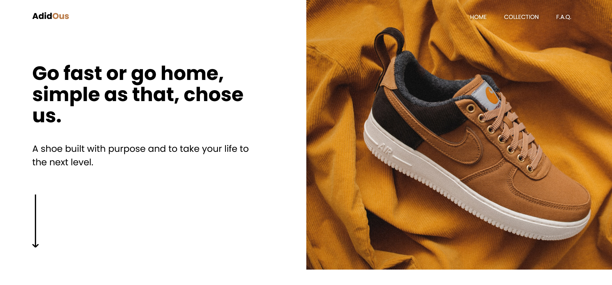

# DesignCourse - Learn HTML & CSS in 2022 | Crash Course

My source code to the [Learn HTML & CSS in 2022 | Crash Course by DesignCourse](https://youtu.be/gXLjWRteuWI). That was the first ever video course I watched in web developement. I really liked those 2 hours where I knew lots of things but still learned some and consolidated what I knew.

## Table of contents

- [Course links](#course-links)
- [Screenshot](#screenshot)
- [Built with](#built-with)

### Course links

[DesignCourse channel](https://www.youtube.com/channel/UCVyRiMvfUNMA1UPlDPzG5Ow)

[Course video](https://youtu.be/gXLjWRteuWI)

[Figma file](https://www.figma.com/file/ReJbOWDc0WR1uizrsgfyfQ/project?node-id=0%3A1)

### Screenshot

### Built with

- HTML
- Sass
- JavaScript
