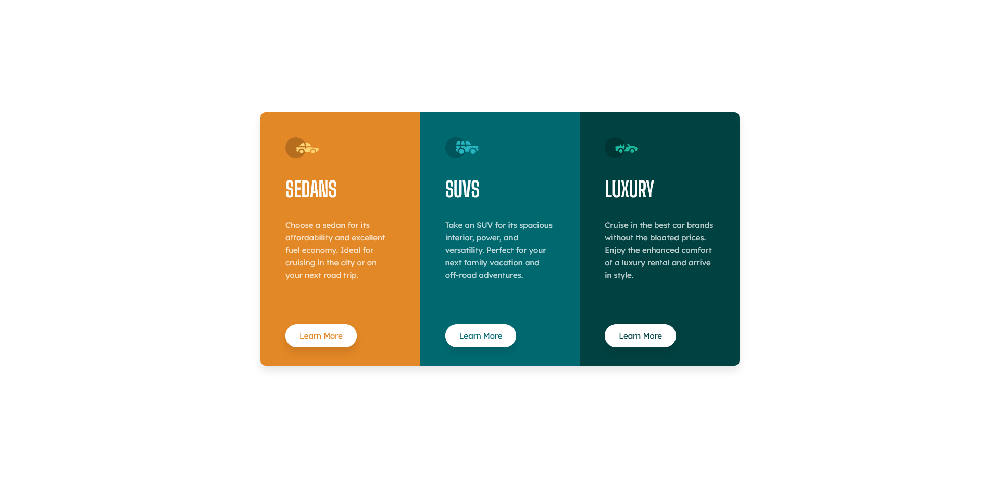

# Frontend Mentor - 3-column preview card component solution

This is my solution to the [3-column preview card component challenge on Frontend Mentor](https://www.frontendmentor.io/challenges/3column-preview-card-component-pH92eAR2-). Frontend Mentor challenges help you improve your coding skills by building realistic projects.

## Table of contents

- [Overview](#overview)
  - [The challenge](#the-challenge)
  - [Screenshots](#screenshot)
- [My process](#my-process)
  - [Built with](#built-with)
  - [Useful resources](#useful-resources)
- [Author](#author)

## Overview

### The challenge

Users should be able to:

- View the optimal layout depending on their device's screen size
- See hover states for interactive elements

### Screenshots

## My process

### Built with

- HTML
- Sass

### Useful resources

- [grid-template-columns](https://developer.mozilla.org/fr/docs/Web/CSS/grid-template-columns) - Helped me for the desktop design

## Author

- Website - [Jérémy CUSIN-MERMET](https://jeremy-cusinmermet.xyz/)
- Frontend Mentor - [@jrmydix](https://www.frontendmentor.io/profile/jrmydix)
- LinkedIn - [jeremy-cusinmermet](https://www.linkedin.com/in/jeremy-cusinmermet/)
- Github - [jrmydix](https://github.com/jrmydix)
