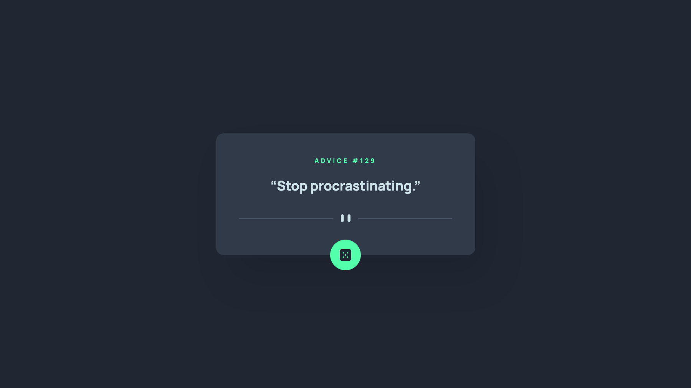
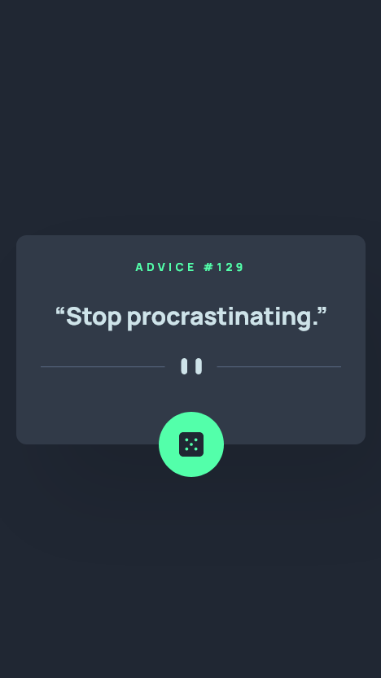

# Frontend Mentor - Advice generator app solution

This is my solution to the [Advice generator app challenge on Frontend Mentor](https://www.frontendmentor.io/challenges/advice-generator-app-QdUG-13db). Frontend Mentor challenges help you improve your coding skills by building realistic projects.

## Table of contents

- [Overview](#overview)
  - [Screenshots](#screenshots)
- [My process](#my-process)
  - [Built with](#built-with)
  - [What I learned](#what-i-learned)
  - [Useful resources](#useful-resources)
- [Author](#author)

## Overview

### Screenshots

- Desktop

  

- Mobile

  

## My process

### Built with

- HTML
- Sass
- JavaScript
- [Advice Slip API](https://api.adviceslip.com/)

### What I learned

I learned API usage in JavaScript! 🙂

### Useful resources

- [Fetch](https://developer.mozilla.org/en-US/docs/Web/API/Fetch_API/Using_Fetch)
- [Request.cache](https://developer.mozilla.org/en-US/docs/Web/API/Request/cache) - Helped me to generate a new advice each time
- [async function](https://developer.mozilla.org/en-US/docs/Web/JavaScript/Reference/Statements/async_function)

## Author

- Website - [Jérémy CUSIN-MERMET](https://jeremy-cusinmermet.xyz/)
- Frontend Mentor - [@jrmydix](https://www.frontendmentor.io/profile/jrmydix)
- LinkedIn - [jeremy-cusinmermet](https://www.linkedin.com/in/jeremy-cusinmermet/)
- Github - [jrmydix](https://github.com/jrmydix)
