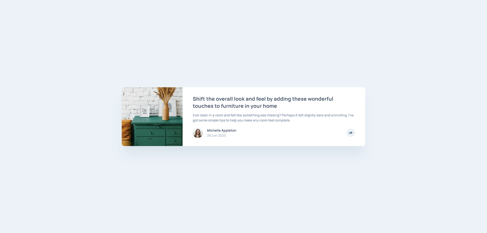
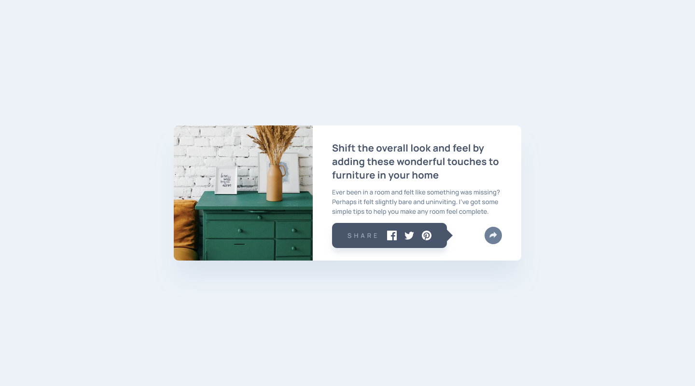
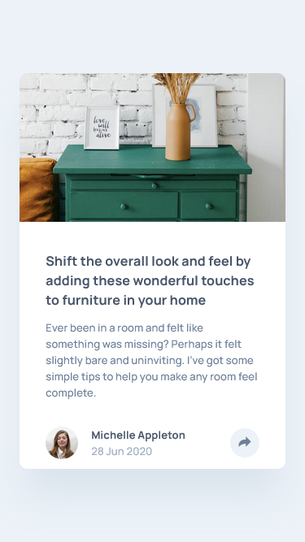
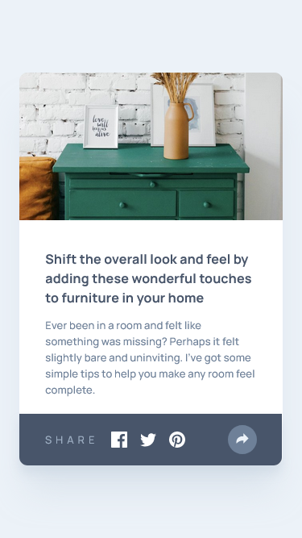

# Frontend Mentor - Article preview component solution

This is my solution to the [Article preview component challenge on Frontend Mentor](https://www.frontendmentor.io/challenges/article-preview-component-dYBN_pYFT). Frontend Mentor challenges help you improve your coding skills by building realistic projects.

## Table of contents

- [Overview](#overview)
  - [The challenge](#the-challenge)
  - [Screenshot](#screenshot)
- [My process](#my-process)
  - [Built with](#built-with)
- [Author](#author)

## Overview

### The challenge

Users should be able to:

- View the optimal layout for the component depending on their device's screen size
- See the social media share links when they click the share icon

### Screenshots

- Desktop

  

- Desktop active

  

- Mobile

  

- Mobile active

  

## My process

### Built with

- HTML
- Sass
- JavaScript

## Author

- Website - [Jérémy CUSIN-MERMET](https://jeremy-cusinmermet.xyz/)
- Frontend Mentor - [@jrmydix](https://www.frontendmentor.io/profile/jrmydix)
- LinkedIn - [jeremy-cusinmermet](https://www.linkedin.com/in/jeremy-cusinmermet/)
- Github - [jrmydix](https://github.com/jrmydix)
