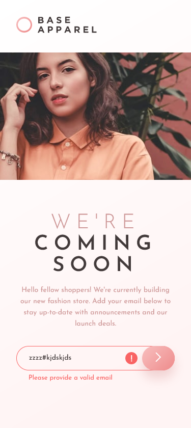

# Frontend Mentor - Base Apparel coming soon page solution

This is my solution to the [Base Apparel coming soon page challenge on Frontend Mentor](https://www.frontendmentor.io/challenges/base-apparel-coming-soon-page-5d46b47f8db8a7063f9331a0). Frontend Mentor challenges help you improve your coding skills by building realistic projects.

## Table of contents

- [Overview](#overview)
  - [The challenge](#the-challenge)
  - [Screenshots](#screenshots)
- [My process](#my-process)
  - [Built with](#built-with)
- [Author](#author)

## Overview

### The challenge

Users should be able to:

- View the optimal layout for the site depending on their device's screen size
- See hover states for all interactive elements on the page
- Receive an error message when the `form` is submitted if:
  - The `input` field is empty
  - The email address is not formatted correctly

### Screenshots

- Desktop

  

- Mobile

  

- Desktop: active

  

- Mobile: active

  

## My process

### Built with

- HTML
- Sass
- JavaScript

## Author

- Website - [Jérémy CUSIN-MERMET](https://jeremy-cusinmermet.xyz/)
- Frontend Mentor - [@jrmydix](https://www.frontendmentor.io/profile/jrmydix)
- LinkedIn - [jeremy-cusinmermet](https://www.linkedin.com/in/jeremy-cusinmermet/)
- Github - [jrmydix](https://github.com/jrmydix)
