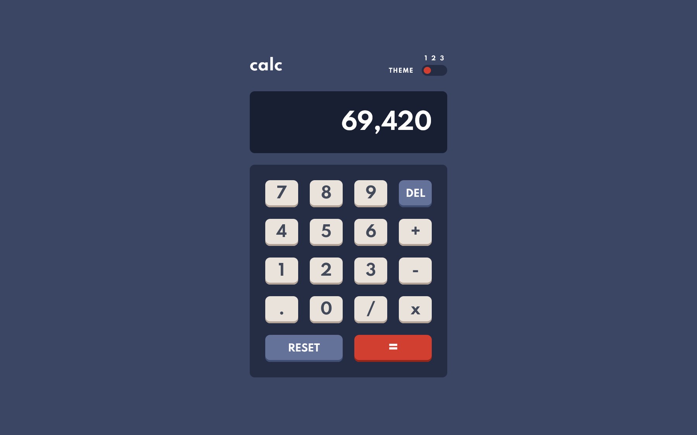
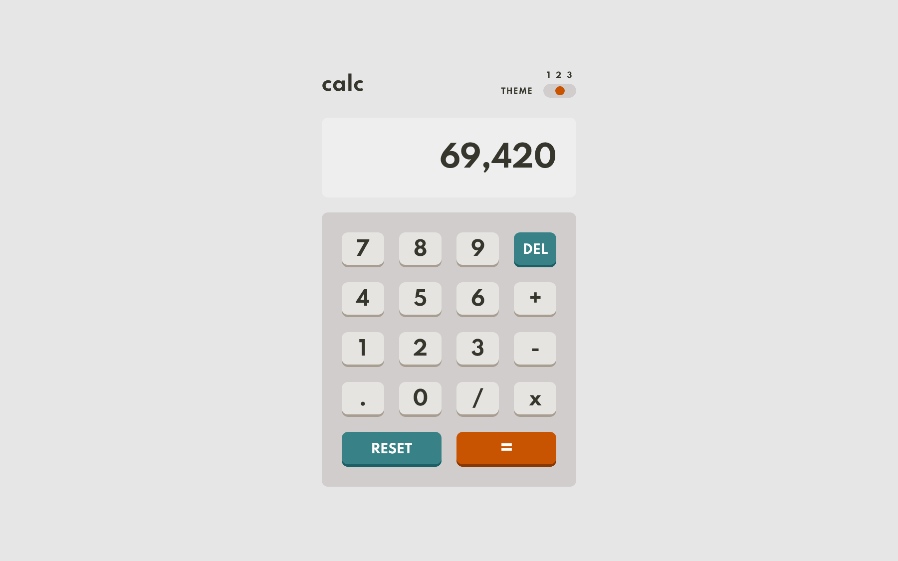
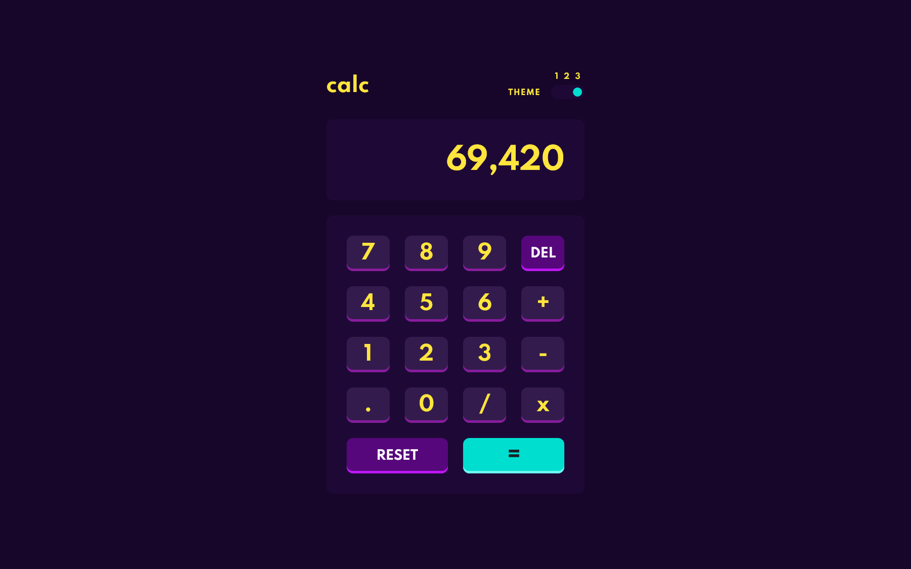

# Frontend Mentor - Calculator app solution

This is my solution to the [Calculator app challenge on Frontend Mentor](https://www.frontendmentor.io/challenges/calculator-app-9lteq5N29). Frontend Mentor challenges help you improve your coding skills by building realistic projects.

## Table of contents

- [Overview](#overview)
  - [The challenge](#the-challenge)
  - [Screenshots](#screenshots)
- [My process](#my-process)
  - [Built with](#built-with)
  - [Useful resources](#useful-resources)
- [Author](#author)

## Overview

### The challenge

Users should be able to:

- See the size of the elements adjust based on their device's screen size
- Perform mathmatical operations like addition, subtraction, multiplication, and division
- Adjust the color theme based on their preference
- **Bonus**: Have their initial theme preference checked using `prefers-color-scheme` and have any additional changes saved in the browser

### Screenshots

- Theme 1

  

- Theme 2

  

- Theme 3

  

## My process

### Built with

- HTML
- Sass
- JavaScript

### Useful resources

- [How to create a three state toggle switch](https://webcodespace.com/how-to-create-a-three-state-toggle-switch-using-html-css-and-javascript)
- [How to build an html calculator app](https://www.freecodecamp.org/news/how-to-build-an-html-calculator-app-from-scratch-using-javascript-4454b8714b98/)

## Author

- Website - [Jérémy CUSIN-MERMET](https://jeremy-cusinmermet.xyz/)
- Frontend Mentor - [@jrmydix](https://www.frontendmentor.io/profile/jrmydix)
- LinkedIn - [jeremy-cusinmermet](https://www.linkedin.com/in/jeremy-cusinmermet/)
- Github - [jrmydix](https://github.com/jrmydix)
