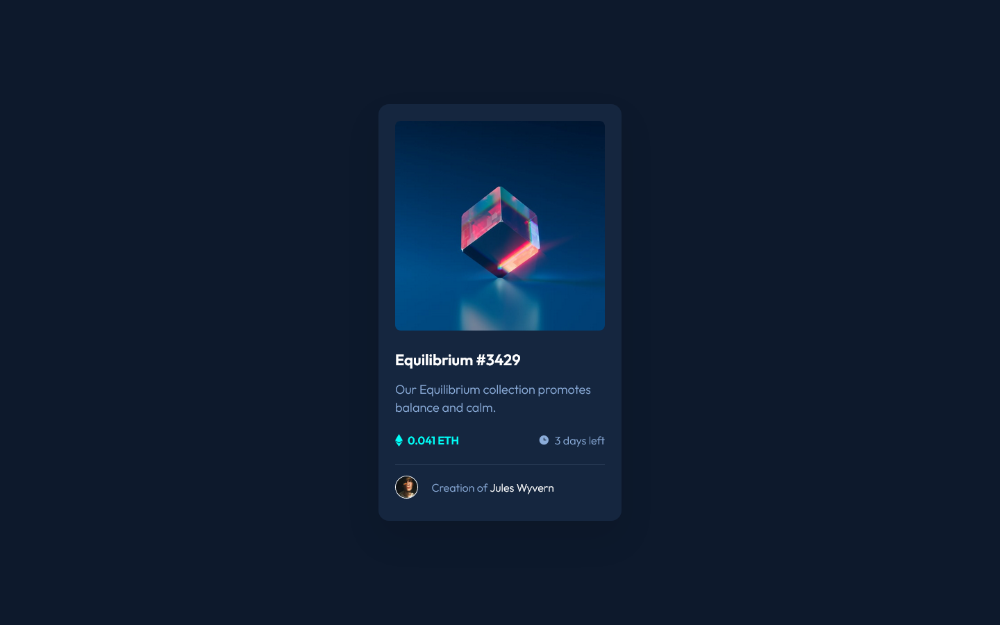

# Frontend Mentor - NFT preview card component solution

This is my solution to the [NFT preview card component challenge on Frontend Mentor](https://www.frontendmentor.io/challenges/nft-preview-card-component-SbdUL_w0U). Frontend Mentor challenges help you improve your coding skills by building realistic projects.

## Table of contents

- [Overview](#overview)
  - [The challenge](#the-challenge)
  - [Screenshot](#screenshot)
- [My process](#my-process)
  - [Built with](#built-with)
  - [What I learned](#what-i-learned)
  - [Useful resources](#useful-resources)
- [Author](#author)

## Overview

### Screenshot

### The challenge

Users should be able to:

- View the optimal layout depending on their device's screen size
- See hover states for interactive elements

## My process

### Built with

- HTML
- Sass

### What I learned

I learned about the vertical-align CSS property, and how to display an overlay image/text on hover.

### Useful resources

- [vertical-align - CSS](https://developer.mozilla.org/fr/docs/Web/CSS/vertical-align) - Helped me to center svgs with text
- [W3Schools How To - Image Hover Overlay](https://www.w3schools.com/howto/howto_css_image_overlay.asp) - Tried things for an hour, then found about this which helped me make the image view overlay.

## Author

- Website - [Jérémy CUSIN-MERMET](https://jeremy-cusinmermet.xyz/)
- Frontend Mentor - [@jrmydix](https://www.frontendmentor.io/profile/jrmydix)
- LinkedIn - [jeremy-cusinmermet](https://www.linkedin.com/in/jeremy-cusinmermet/)
- Github - [jrmydix](https://github.com/jrmydix)
